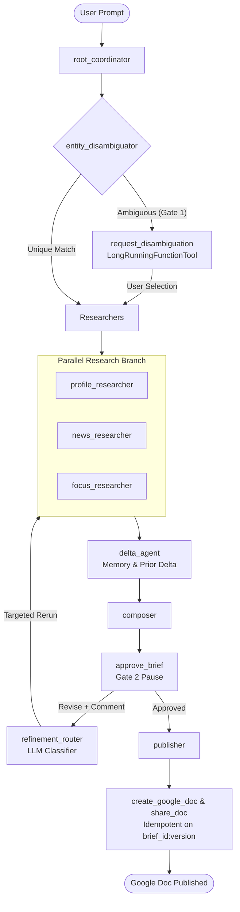

# Meeting Prep Copilot — Multi-Agent Research Assistant

An enterprise-grade, ADK-first multi-agent briefing assistant designed to prepare executive research briefs before meetings with external companies, built with Google Agent Development Kit (ADK) and Gemini Enterprise Agent Platform (GEAP).

Source of truth and architecture design: [docs/hld.md](docs/hld.md).

---

## Architecture (Phases 1–3)



### Key Capabilities

1. **Multi-Agent Research Pipeline (Phase 1)**:
   - **`root_coordinator`**: Ingests free-text prompts, extracts target company, focus topics, and recipient lists.
   - **`entity_disambiguator`**: Verifies company domain and business entity.
   - **Parallel Researchers**: Concurrently executes company profile analysis, recent news retrieval, and user-specified focus area deep dives.
   - **`delta_agent`**: Computes the incremental delta against prior briefings (the memory bank backend is stubbed until Phase 5).
   - **`composer`**: Synthesizes findings into an executive markdown briefing with structured sections.

2. **Human-In-The-Loop (HITL) Workflow (Phase 2)**:
   - **Non-blocking Pauses**: Implemented using ADK's `LongRunningFunctionTool` primitive (`request_disambiguation` and `approve_brief`).
   - **Stateless Two-Legged Invocations**: Pauses hold zero open network connections; state is maintained in the session store. Execution resumes seamlessly upon receiving a matching `FunctionResponse`.
   - **LLM Refinement Router**: If the reviewer requests revisions, `refinement_router` classifies feedback and selectively triggers **only** the affected researchers, preserving unchanged sections and minimizing redundant LLM calls.

3. **Publishing & Idempotency (Phase 3)**:
   - **`create_google_doc`**: Converts markdown briefings to native Google Docs via the Google Drive API (`uploadType=multipart`).
   - **Strict Idempotency**: Document creation is idempotent on `(brief_id, version)`. Repeated approvals return the existing `DocRef` without re-creating files or leaving duplicate docs in Drive.
   - **Error-Isolated Sharing (`share_doc`)**: Shares documents with individual recipients; failures on one recipient do not abort others.
   - **Decoupled Identity Provider**: Eliminates hardcoded credentials inside tools. Outbound Drive calls support both offline stub execution and live Drive publishing via user-delegated authority.

---

## Local Development Setup

### 1. Prerequisites & Installation

Requires Python 3.11+.

```bash
# Create virtual environment and install dependencies
python3 -m venv .venv
source .venv/bin/activate
pip install -r requirements.txt
```

### 2. Google Cloud Authentication

Authenticate with Google Cloud to enable Vertex AI Gemini model inference:

```bash
gcloud auth application-default login
```

The active GCP project is dynamically detected from your environment (`GOOGLE_CLOUD_PROJECT` or `gcloud config get-value project`).

---

## Running the Copilot

### 1. Interactive CLI Client

The interactive CLI ([meeting_prep/cli.py](meeting_prep/cli.py)) is the primary interface to experience the full Human-In-The-Loop review cycle:

```bash
# Provide a prompt directly:
.venv/bin/python -m meeting_prep.cli "Prepare an executive briefing for my upcoming meeting with Stripe. Focus on AI agent payments."

# Or launch interactively:
.venv/bin/python -m meeting_prep.cli
```

**Interactive Walkthrough**:
1. The agent gathers intelligence and displays the formatted brief draft in the terminal.
2. Prompts for your decision:
   ```text
   Decision: [A]pprove & Publish, or [R]evise with feedback? [a/r]:
   ```
3. Type `r` to supply feedback (e.g. *"Focus more on their Stablecoin partnerships"*). The refinement router will classify your feedback, rerun the relevant researcher, and render an updated draft.
4. Type `a` to approve. The publisher generates the Google Doc and outputs the link.

### 2. Automated Headless Verification Scripts

Run the standalone verification suites for each phase:

```bash
# Phase 1: Multi-agent execution and session state contracts
.venv/bin/python scripts/run_phase1.py

# Phase 2: HITL pause/resume, targeted router reruns, and disambiguation
.venv/bin/python scripts/run_phase2.py

# Phase 3: Document publishing and double-approval idempotency
.venv/bin/python scripts/run_phase3.py
```

### 3. Running Unit Tests

Execute the unit test suite:

```bash
.venv/bin/python -m unittest discover -s tests
```

---

## Google Drive Publishing Modes (Phase 3)

The Google Drive client supports dual modes configured via `DRIVE_CLIENT_MODE`:

### Mode A: Offline Stub (Default)

Fast, offline, and deterministic. Simulates Drive API file creation and permissions without making network calls or requiring Drive OAuth grants:

```bash
DRIVE_CLIENT_MODE=stub .venv/bin/python scripts/run_phase3.py
```

### Mode B: Live Google Drive (Local Development Stand-in)

Publishes a real Google Doc directly to a user's Google Drive account.

> [!NOTE]
> Mode B provides a local development stand-in using user-authorized OAuth credentials. Full HLD §12A.2 delegation via GEAP Agent Identity Auth Manager (where credentials are encrypted and injected at the Agent Gateway without touching agent code) lands in Phase 4.
>
> Per HLD §12A.1 and §12A.3, running with `DRIVE_CLIENT_MODE=drive` without valid delegated credentials fails loudly with a `RuntimeError` rather than silently falling back to ambient gcloud ADC or workstation service accounts.

**Credential Options**:
1. **Interactive browser OAuth** (recommended for local dev):
   ```bash
   .venv/bin/python scripts/auth_drive_user.py
   ```
   *(Signs in via browser and saves credentials to `.drive_user_token.json` or path in `DRIVE_CREDENTIALS_FILE`)*.

2. **Direct delegated token**:
   ```bash
   export DRIVE_USER_TOKEN="<oauth-access-token>"
   ```

3. **SPIFFE / Workload Identity Federation (WIF)**:
   Set `SPIFFE_TOKEN` (or path via `SPIFFE_SVID_PATH`), `GCP_PROJECT_NUMBER`, and optionally `SPIFFE_WIF_POOL` and `SPIFFE_WIF_PROVIDER` for STS token exchange, or point `GOOGLE_APPLICATION_CREDENTIALS` to an external account configuration.

**Run with live publishing**:
```bash
DRIVE_CLIENT_MODE=drive .venv/bin/python scripts/run_phase3.py
```

---

## Local Observability with `adk web`

To visualize the multi-agent graph topology and inspect execution traces in the ADK Web UI:

```bash
.venv/bin/adk web --port 8080 meeting_prep
```

Navigate to `http://localhost:8080/` to explore agent nodes, tool call arguments, and latency breakdowns.

---

## License

Distributed under the [MIT License](LICENSE).
