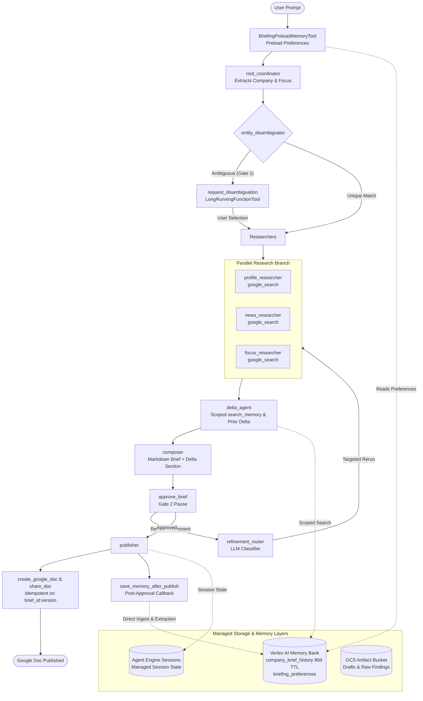

# Meeting Prep Copilot — Multi-Agent Research Assistant

An enterprise-grade, ADK-first multi-agent briefing assistant designed to prepare executive research briefs before meetings with external companies, built with Google Agent Development Kit (ADK) and Gemini Enterprise Agent Platform (GEAP).

Source of truth and architecture design: [docs/hld.md](docs/hld.md).

---

## Architecture (Phases 1–5)



### Key Capabilities

1. **Multi-Agent Research Pipeline (Phase 1)**:
   - **`root_coordinator`**: Ingests free-text prompts, extracts target company, focus topics, and recipient lists. Preloads standing preferences from Memory Bank.
   - **`entity_disambiguator`**: Verifies company domain and business entity against public web grounding.
   - **Parallel Researchers**: Concurrently executes company profile analysis (`profile_researcher`), recent news retrieval (`news_researcher`), and user-specified focus area deep dives (`focus_researcher`).
   - **`delta_agent`**: Computes incremental delta against prior briefings retrieved from Memory Bank (`has_prior`, structured fact comparisons, word boundary isolation, and recency sorting per HLD §9).
   - **`composer`**: Synthesizes findings into an executive markdown briefing with structured sections, prominent delta analysis, and inline source citations.

2. **Human-In-The-Loop (HITL) Workflow (Phase 2)**:
   - **Non-blocking Pauses**: Implemented using ADK's `LongRunningFunctionTool` primitive (`request_disambiguation` for Gate 1, `approve_brief` for Gate 2).
   - **Stateless Two-Legged Invocations**: Pauses hold zero open network connections; state is maintained in the session store. Execution resumes seamlessly upon receiving a matching `FunctionResponse`.
   - **LLM Refinement Router**: If the reviewer requests revisions, `refinement_router` classifies feedback and selectively triggers **only** the affected researchers, preserving unchanged sections and minimizing redundant LLM calls.

3. **Publishing & Idempotency (Phase 3)**:
   - **`create_google_doc`**: Converts markdown briefings to native Google Docs via the Google Drive API (`uploadType=multipart`).
   - **Strict Idempotency**: Document creation is idempotent on `(brief_id, version)`. Repeated approvals return the existing `DocRef` without re-creating files or leaving duplicate docs in Drive.
   - **Error-Isolated Sharing (`share_doc`)**: Shares documents with individual recipients; failures on one recipient do not abort others.
   - **Decoupled Identity Provider**: Eliminates hardcoded credentials inside tools. Outbound Drive calls support offline stub execution, local browser OAuth, and live Drive publishing via user-delegated authority.

4. **Agent Runtime, Agent Identity & REST Server (Phase 4)**:
   - **Vertex AI Agent Engine (Reasoning Engine)**: Full deployment to Google Cloud Vertex AI Agent Engine with managed session persistence (`VertexAiSessionService`) and artifact storage (`GcsArtifactService`).
   - **SPIFFE Agent Identity (`AGENT_IDENTITY`)**: Deployed under a dedicated per-agent SPIFFE identity principal with least-privilege IAM roles (`roles/aiplatform.agentDefaultAccess`, `roles/aiplatform.expressUser`, `roles/storage.objectUser`), rejecting ambient service accounts (HLD §12A.1).
   - **FastAPI REST API (`meeting_prep/server.py`)**: Programmatic REST interface implementing two-leg execution with non-blocking pauses (`POST /briefs`, `POST /briefs/{id}/decision`, `GET /briefs/{id}`, `GET /health`). Recovers pending function calls directly from session events without requiring an auxiliary database.
   - **Remote Interactive CLI**: Interactive CLI supports connecting directly to a remote deployed Agent Engine instance (`--engine-id`) with event streaming and remote HITL approval.
   - **User-Delegated Remote Drive Publishing**: Facilitates end-user Drive authorization in remote Agent Engine executions via transient bearer token delegation (`delegated_drive_token`).

5. **Long-Term Memory Bank & Incremental Delta Retrieval (Phase 5)**:
   - **Vertex AI Memory Bank**: Managed cross-session memory backed by `VertexAiMemoryBankService` (with `LocalMemoryService` in-memory fallback for local development).
   - **Custom Topics & Retention**:
     - `company_brief_history`: 90-day TTL (`7776000s`) capturing structured fact comparisons, headline findings, and published doc links.
     - `briefing_preferences`: Indefinite retention for standing user preferences (e.g. focus areas, formatting preferences, recipient lists).
   - **Post-Approval Write Callback (`save_memory_after_publish`)**: Attached `after_agent` to `publisher`. Ingests memory **strictly on approval**, preventing rejected or unverified drafts from polluting long-term memory. Employs direct `add_memory` ingestion for structured brief history and extraction for user preferences.
   - **Dual Read Strategies**:
     - Turn-start preference preloading on `root_coordinator` via `BriefingPreloadMemoryTool` and `initialize_briefing_session`.
     - Scoped delta retrieval on `delta_agent` via company-scoped `search_memory`, using regex word boundary isolation (`_company_matches`) to avoid cross-company false positives and ISO recency sorting.
   - **Fail-Loud Cloud Placeholder**: `UnconfiguredCloudMemoryService` ensures import safety for `server.py` at boot while raising an explicit `RuntimeError` on read/write if deployed to cloud without a configured `AGENT_ENGINE_ID`.

---

## Local Development Setup

### 1. Prerequisites & Installation

Requires Python 3.11+.

```bash
# Create virtual environment and install dependencies
python3 -m venv .venv
source .venv/bin/activate
pip install -r requirements.txt
```

### 2. Google Cloud Authentication

Authenticate with Google Cloud to enable Vertex AI Gemini model inference:

```bash
gcloud auth application-default login
```

The active GCP project is dynamically detected from your environment (`GOOGLE_CLOUD_PROJECT` or `gcloud config get-value project`).

---

## Running the Copilot

### 1. Interactive CLI Client

The interactive CLI ([meeting_prep/cli.py](meeting_prep/cli.py)) drives the full Human-In-The-Loop review cycle:

```bash
# Run locally in-process:
.venv/bin/python -m meeting_prep.cli "Prepare an executive briefing for my upcoming meeting with Stripe. Focus on AI agent payments."

# Or launch interactively:
.venv/bin/python -m meeting_prep.cli

# Or run interactively against a deployed Vertex AI Agent Engine:
.venv/bin/python -m meeting_prep.cli --engine-id <AGENT_ENGINE_ID> "Brief me for meeting with Anthropic."
```

**Interactive Walkthrough**:
1. Preloads standing preferences from Memory Bank if available.
2. The agent gathers intelligence and displays the formatted brief draft in the terminal.
3. Prompts for your decision:
   ```text
   Decision: [A]pprove & Publish, or [R]evise with feedback? [a/r]:
   ```
4. Type `r` to supply feedback (e.g. *"Focus more on their Stablecoin partnerships"*). The refinement router will classify your feedback, rerun the relevant researcher, and render an updated draft.
5. Type `a` to approve. The publisher generates the Google Doc, outputs the link, and triggers the `save_memory_after_publish` callback to record the brief in Memory Bank.

### 2. Programmatic REST API Server

Meeting Prep Copilot provides a FastAPI REST interface ([meeting_prep/server.py](meeting_prep/server.py)) supporting two-leg non-blocking HITL execution (HLD §10.3, §12.2):

```bash
# Start the REST API server:
.venv/bin/uvicorn meeting_prep.server:server --host 0.0.0.0 --port 8000
```

#### API Endpoints

| Method | Endpoint | Description |
|---|---|---|
| `GET` | `/health` | Health check endpoint returning service status and environment. |
| `POST` | `/briefs` | **Leg 1**: Ingests prompt, runs research pipeline, pauses at HITL gate (`approve_brief` or `request_disambiguation`), returns session ID and draft. |
| `GET` | `/briefs/{id}?user_id={uid}` | Retrieves session status, pending gate name, and current draft. |
| `POST` | `/briefs/{id}/decision` | **Leg 2**: Submits user decision (`status: approved` or `status: revise`), resumes execution, and returns published doc URL. |

#### Example REST Workflow (curl)

```bash
# 1. Start Leg 1 (runs until Gate 2 pause):
curl -X POST http://localhost:8000/briefs \
  -H "Content-Type: application/json" \
  -d '{"prompt": "Brief me on Datadog for upcoming partnership call.", "user_id": "exec_1"}'

# Response returns: {"status": "paused", "session_id": "...", "gate": "approve_brief", "draft": "..."}

# 2. Submit approval to resume Leg 2 and publish:
curl -X POST http://localhost:8000/briefs/<SESSION_ID>/decision \
  -H "Content-Type: application/json" \
  -d '{"status": "approved", "user_id": "exec_1"}'

# Response returns: {"status": "completed", "doc_url": "https://docs.google.com/document/d/..."}
```

### 3. Automated Verification Suites

Run the standalone verification suites for each phase:

```bash
# Phase 1: Multi-agent execution and session state contracts
.venv/bin/python scripts/run_phase1.py

# Phase 2: HITL pause/resume, targeted router reruns, and disambiguation
.venv/bin/python scripts/run_phase2.py

# Phase 3: Document publishing and double-approval idempotency
.venv/bin/python scripts/run_phase3.py

# Phase 4 (In-Process): REST API two-leg HITL contracts and session recovery
.venv/bin/python scripts/run_phase4.py

# Phase 4 (Remote Runtime): Verify deployed Agent Engine endpoint / api_server
.venv/bin/python scripts/verify_deployed_runtime.py --endpoint-url http://localhost:8000

# Phase 5 (Local Lifecycle): 2-run lifecycle (baseline creation, delta retrieval, and preference preloading)
.venv/bin/python scripts/run_phase5.py

# Phase 5 (Remote Memory Bank): Cross-session retrieval and active polling against deployed Agent Engine
.venv/bin/python scripts/verify_remote_memory.py [AGENT_ENGINE_ID]
```

### 4. Running Unit Tests

Execute the full unit test suite (37 unit tests covering Drive tools, Memory Bank, and REST server):

```bash
.venv/bin/python -m unittest discover -s tests
```

---

## Infrastructure & Agent Engine Deployment (Phase 4)

### 1. Terraform Infrastructure (`infra/`)

Terraform configurations ([infra/main.tf](infra/main.tf)) manage cloud resources:
- **GCS Artifact Bucket**: Dedicated bucket (`${project_id}-meeting_prep-artifacts`) for storing draft markdown versions and raw search findings.
- **Agent Identity IAM Roles**: Provisioned per-agent SPIFFE principal receives `roles/aiplatform.agentContextEditor`, `roles/aiplatform.agentDefaultAccess`, `roles/aiplatform.expressUser`, and `roles/storage.objectUser` on the artifact bucket.

```bash
cd infra
terraform init
terraform apply -var="project_id=$(gcloud config get-value project)"
```

### 2. Deploying to Vertex AI Agent Engine

Use the deployment script ([scripts/deploy_agent_engine.sh](scripts/deploy_agent_engine.sh)) to package and deploy the copilot:

```bash
# Deploy new or update existing Agent Engine instance
./scripts/deploy_agent_engine.sh
```

The script sets `DEPLOYMENT_ENV=cloud`, configures Cloud Trace export (`--otel_to_cloud`), specifies the artifact bucket, and packages the application using `adk deploy agent_engine`.

---

## Long-Term Memory Bank Architecture (Phase 5)

Meeting Prep Copilot implements a three-tier memory architecture (HLD §9):

1. **Layer 1: Session State (`VertexAiSessionService`)**: Holds intra-session context across HITL pause/resume legs and refinement iterations.
2. **Layer 2: Artifacts (`GcsArtifactService`)**: Persists versioned briefing drafts (`brief_draft_v{n}.md`) and raw search responses for context compaction and diff audits.
3. **Layer 3: Long-Term Memory (`VertexAiMemoryBankService`)**: Managed cross-session memory in Agent Engine Memory Bank.

```
┌─────────────────────────────────────────────────────────────────────────┐
│                       Vertex AI Memory Bank                             │
├────────────────────────────────────┬────────────────────────────────────┤
│ Topic: company_brief_history       │ Topic: briefing_preferences        │
│ TTL: 90 days (7776000s)            │ TTL: Indefinite                    │
│ Content: Structured fact records   │ Content: User focus areas, format  │
│ (headline facts, doc link, date)   │ preferences, recipient lists       │
│ Write: Direct add_memory on approve│ Write: add_session_to_memory       │
│ Read: Company-scoped search_memory │ Read: BriefingPreloadMemoryTool    │
└────────────────────────────────────┴────────────────────────────────────┘
```

### Key Memory Implementation Details

- **Post-Approval Ingestion**: `save_memory_after_publish` callback in [meeting_prep/callbacks/memory.py](meeting_prep/callbacks/memory.py) ensures only approved briefs enter long-term storage.
- **Custom Memory Topic Schema**: Metadata payloads use `topics=[{"custom_memory_topic_label": "company_brief_history"}]` adhering strictly to Vertex AI's `AgentEngineMemoryConfig` schema.
- **Word-Boundary Company Isolation**: `_company_matches` in [meeting_prep/tools/memory.py](meeting_prep/tools/memory.py) uses regex word boundaries (`\b`) to prevent substring collisions (e.g. `Box` will not match `Boxed`, while `Meta` correctly matches `Meta Platforms`).
- **Recency Sorting**: Undated records fall back to `""` so ISO dates (`"2026-..."`) strictly win descending recency sort.
- **Delta Presentation**: When `has_prior` is true, the brief opens with `### What Changed Since Prior Briefing (YYYY-MM-DD)` highlighting new developments; when false, an explicit baseline marker is rendered.

---

## Google Drive Publishing Modes (Phase 3 & 4)

Configured via the `DRIVE_CLIENT_MODE` environment variable:

### Mode A: Offline Stub (Default)

Fast, offline, and deterministic. Simulates Drive API file creation and permissions without making network calls or requiring Drive OAuth grants:

```bash
DRIVE_CLIENT_MODE=stub .venv/bin/python scripts/run_phase3.py
```

### Mode B: Live Google Drive

Publishes real Google Docs directly to Google Drive with strict idempotency on `(brief_id, version)`.

**Credential Options**:
1. **Interactive browser OAuth** (recommended for local dev):
   ```bash
   .venv/bin/python scripts/auth_drive_user.py
   ```
   *(Signs in via browser and saves credentials to `.drive_user_token.json` or path in `DRIVE_CREDENTIALS_FILE`)*.

2. **Direct delegated token**:
   ```bash
   export DRIVE_USER_TOKEN="<oauth-access-token>"
   ```

3. **Remote Agent Engine Delegation**:
   When invoking the remote Agent Engine or REST API, pass the user OAuth access token in the request (`user_token`) or session state (`delegated_drive_token`). The agent creates documents as the user without holding static keys in the container.

---

## Observability & Inspection

### 1. Local Graph Topology with `adk web`

To visualize the multi-agent graph topology and inspect execution traces in the ADK Web UI:

```bash
.venv/bin/adk web --port 8080 meeting_prep
```

Navigate to `http://localhost:8080/` to explore agent nodes, tool call arguments, and latency breakdowns.

### 2. Cloud Trace & OpenTelemetry

Deployed Agent Engine instances export OpenTelemetry traces directly to Google Cloud Trace (`--otel_to_cloud`), capturing:
- Concurrent researcher spans in `ParallelAgent`.
- Dedicated span duration for Human-In-The-Loop pauses.
- Refinement router classification targets and directives.

---

## License

Distributed under the [MIT License](LICENSE).
